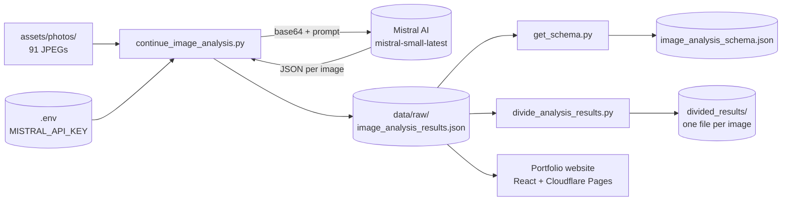

# Sher Mohammad Carpentry Analysis


**Turn a folder of phone photos into structured, website-ready metadata for a carpentry portfolio — using AI vision, not manual tagging.**

This project analyzes Sher Mohammad's carpentry work photos with Mistral AI's vision model and produces a single structured JSON catalog: materials, joinery techniques, craftsmanship quality, design style, SEO keywords, and per-image presentation recommendations. The output feeds directly into a separate portfolio website (React + Cloudflare Pages) so every gallery image ships with a caption, an alt-text keyword set, and a placement suggestion.

---

## ✨ Features

- **AI vision cataloging** — every photo is read by `mistral-small-latest` and reduced to a fixed JSON schema across 10 analysis dimensions (identification, materials, joinery, craftsmanship, design, project context, tools, aesthetics, technical challenges, presentation).
- **Resumable batch processing** — the primary script loads existing results, skips photos already analyzed, and saves progress after every batch. Interrupted runs pick up where they left off.
- **Craftsmanship scoring** — each image gets a 1–10 quality rating and a `best_use` recommendation (Hero image / Detail showcase / Process / Comparison) for portfolio layout.
- **SEO-ready output** — primary and secondary keyword sets are extracted per image and aggregated into a top-level `seo_optimization` block for meta tags and alt text.
- **Schema introspection** — `get_schema.py` derives a JSON Schema from the results so downstream consumers (the website) can validate imports.
- **Per-image split** — `divide_analysis_results.py` breaks the monolithic results file into one JSON file per photo plus a master index, for granular consumption.
- **Rate-limit aware** — built-in delays between images and batches keep calls inside Mistral's free-tier limits.

---

## 📦 Installation

Prerequisites: **Python 3.7+** and a **Mistral AI API key** (get one at <https://console.mistral.ai>).

```bash
# 1. Clone
git clone https://github.com/bhoot1234567890/sher-mohammad-carpentry-analysis.git
cd sher-mohammad-carpentry-analysis

# 2. Create and activate a virtual environment
python3 -m venv venv
source venv/bin/activate

# 3. Install dependencies
pip install mistralai python-dotenv tqdm genson

# 4. Add your API key
echo "MISTRAL_API_KEY=your_api_key_here" > .env
```

Dependencies are the only runtime requirements:

| Package         | Used by                                   |
| --------------- | ----------------------------------------- |
| `mistralai`     | All analysis scripts (vision API calls)   |
| `python-dotenv` | Loads `MISTRAL_API_KEY` from `.env`       |
| `tqdm`          | Progress bar in `analyze_carpentry_images.py` |
| `genson`        | `get_schema.py` (JSON Schema derivation)  |

No `requirements.txt` or `pyproject.toml` ships with the repo — install the four packages above manually.

---

## 🚀 Usage

All commands run from the **repository root** (the scripts glob `assets/photos/` and read/write `data/raw/` relative to the current directory).

### Analyze the full portfolio (primary command)

```bash
python scripts/continue_image_analysis.py
```

This loads `data/raw/image_analysis_results.json`, finds any photos in `assets/photos/` not yet analyzed, processes them in batches of 3, and appends the results. Expected console output:

```text
Total images: 91
Already processed: 91
Remaining to process: 0
All images have been processed!
```

### Validate the setup on a single image

```bash
python scripts/test_single_image.py
```

Sends one photo to Mistral and prints the parsed JSON — the fastest way to confirm the API key and connectivity work before a full run.

### Regenerate the JSON Schema

```bash
python scripts/get_schema.py
```

Reads the results file and writes `image_analysis_schema.json` describing the analysis shape (useful for validating imports on the website side).

### Split results into per-image files

```bash
python scripts/divide_analysis_results.py
```

Produces `data/results/divided_results/` containing `metadata.json`, `analysis_prompt.json`, `images_summary.json`, `index.json`, and an `images/` directory with one JSON file per photo.

### Other scripts

| Script                              | Purpose                                                     |
| ----------------------------------- | ----------------------------------------------------------- |
| `analyze_carpentry_images.py`       | Full run from scratch with a progress bar (expects a `photos/` dir in the cwd) |
| `analyze_carpentry_images_batch.py` | Batch variant with a condensed prompt (batch size 5)        |
| `quick_image_analysis.py`           | Fast pass — basic metadata only                             |
| `get_image_descriptions.py`         | Plain-text descriptions instead of structured JSON          |
| `analyze_sample_images.py`          | Demonstrates the system on the first 6 photos               |
| `update_portfolio_workflow.py`      | End-to-end helper: analyze → copy to website → deploy → push (paths are hardcoded to the original author's machine; edit before use) |

> **Note on working directories:** `continue_image_analysis.py`, `get_schema.py`, and `divide_analysis_results.py` use repo-root-relative paths. `analyze_carpentry_images.py` and `test_single_image.py` expect to run inside a directory that contains a `photos/` folder — adjust your `cwd` or the glob in the script accordingly.

---

## ⚙️ Configuration

The only required configuration is the API key. The model and pacing are constants defined at the top of each script.

| Setting            | Where                       | Default                | Description                                                        |
| ------------------ | --------------------------- | ---------------------- | ------------------------------------------------------------------ |
| `MISTRAL_API_KEY`  | `.env` (env var)            | — *(required)*         | Mistral AI API key. Scripts fail fast if it is missing.            |
| `model`            | top of each script          | `mistral-small-latest` | Mistral vision-capable chat model.                                 |
| per-image delay    | `time.sleep(...)` in script | 2–5 s                  | Throttle between API calls to respect rate limits.                 |
| `batch_size`       | `continue_image_analysis.py`| 3                      | Images processed before a progress save and a longer batch pause.  |
| `temperature`      | batch/sample scripts        | `0.3`                  | Low temperature for deterministic, consistent JSON output.         |

---

## 🧱 How it works

Each script follows the same Mistral vision pattern: base64-encode the JPEG, send it alongside a structured prompt, strip Markdown fences from the reply, and `json.loads` the result. The primary pipeline is resumable batch processing that accumulates into one results file.



### Result shape

Each analyzed image produces a nested object. A representative entry:

```json
{
  "filename": "WhatsApp Image 2026-01-06 at 21.51.27.jpeg",
  "analysis": {
    "image_type": "Close-up detail",
    "primary_subject": "Handcrafted wooden cabinet with intricate carving",
    "technical_details": {
      "materials": ["Hardwood", "Wood stain", "Protective finish"],
      "joinery_techniques": ["Mortise and tenon", "Dovetail joints", "Hand carving"]
    },
    "craftsmanship_quality": { "precision": "High - ...", "attention_to_detail": "High - ..." },
    "portfolio_presentation": {
      "best_use": "Detail showcase highlighting carving expertise",
      "quality_rating": 10
    },
    "keywords": ["wood carving", "custom cabinet", "heirloom quality"]
  }
}
```

The full analysis framework — all 10 dimensions and the rating scale — is documented in [`docs/image_analysis_prompt.md`](docs/image_analysis_prompt.md).

### Current results

The committed `data/raw/image_analysis_results.json` reflects a completed run:

| Metric                  | Value |
| ----------------------- | ----- |
| Photos analyzed         | 91    |
| Analysis status         | `complete` |
| Unique materials found  | 94    |
| Techniques identified   | 65    |
| Images rated 9–10/10    | 59    |

---

## 📁 Project structure

```text
sher-mohammad-carpentry-analysis/
├── scripts/                # Python analysis & utility scripts
├── assets/photos/          # Source carpentry photos (91 JPEGs)
├── data/
│   ├── raw/                # image_analysis_results.json, schema, descriptions
│   └── results/divided_results/   # Per-image JSON splits + index
├── docs/                   # Analysis prompt, summary, file index, resume PDFs
├── .env                    # MISTRAL_API_KEY (gitignored, create your own)
└── README.md
```

The portfolio website itself lives in a **separate repository** ([`sher-mohammad-carpenter-portfolio`](https://github.com/bhoot1234567890/sher-mohammad-carpenter-portfolio), deployed to <https://sher-mohammad-carpenter.pages.dev>) and is intentionally excluded from this repo via `.gitignore`.

---

## 🤝 Contributing

This is a personal portfolio tool, but the analysis framework is general. To adapt it to another trade (metalwork, masonry, etc.), edit the prompt in `scripts/continue_image_analysis.py` and the criteria in [`docs/image_analysis_prompt.md`](docs/image_analysis_prompt.md). There is no `CONTRIBUTING.md` and no test suite — verify changes by running `test_single_image.py` against a sample photo.

---

## 📄 License

No `LICENSE` file is present in this repository, so the work is **All Rights Reserved** by default. Add a LICENSE file (e.g. MIT) before reusing the code or the generated analysis data.
